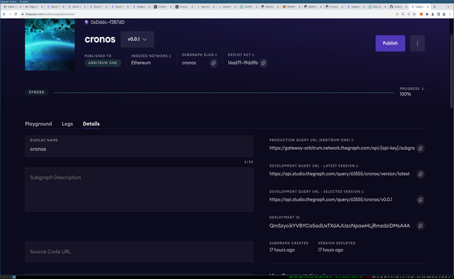

# About

This is my implementation of a subgraph for the Cronos ERC20 token on mainnet Ethereum. You can view the Cronos smart contract on Etherscan at the link below.

https://etherscan.io/address/0xA0b73E1Ff0B80914AB6fe0444E65848C4C34450b#code

## Setup

This subgraph was created by following the [Quick Start](https://thegraph.com/docs/en/quick-start/) tutorial, using Subgraph Studio and the Graph CLI, and then customizing the code. It is up to v0.3.8 now. 

This subgraph has been deployed to Arbitrum One.

## Structure 

From the default template, I removed OwnerTransferred and OwnerDeployed as events from [subgraph.yaml](subgraph.yaml), as entities in [schema.graphql](schema.graphql), and from the mapping file in [src/cro-token.ts](src/cro-token.ts).

I also introduced a number of new entities, other than the default ones.

These entities are: 

- Holder
- DailySale
- Watchlist
- Sampler 

These entities are instantiated in response to qualifying blockchain transactions. They are used to help answer the following types of queries.

Holder creates an entry for every holder of Cronos, and the mapping either increments or decrements their balance. It is intended to show the balance of each Cronos holder.

DailySale creates 'days' numbered based on their distance from the UNIX time start date. This definition of day was chosen because it provides a standard and easily computable reference point. It's meant to show the transactions total & number of sales for each day, defined as a 24 hour block of time (that is, 86400 seconds) counted sequentially from the UNIX time start date.

Watchlist is meant to match transactions on a 'watchlist', a hard coded list of addresses the subgraph creator may wish to monitor. If a 'from' or a 'to' address belongs to a wallet in the watchlist array, it adds the amount of that transaction to a running total. It also records the last indexed block timestamp of an address on that watchlist. Users can then query a watchlist to find out the sum of its transactions and the timestamp of the last recorded transaction.

Sampler is meant to 'sample' transactions in every 100th block, and saves that 'sample' transaction for querying. It also gives a rough count of how many samples have been taken until that point. As shown by the name, it's meant to take a snapshot of every 100th block's transactions.

## Mappings

See the 'handleTransfer' function in [src/cro-token.ts](src/cro-token.ts) to see the relevant mapping code.

For each transaction, handleTransfer calls these functions:
- saveTransfer
- updateHolderBalances
- saveDailySale
- watchlistCheck
- saveSampler

When a Transfer event is emitted by the Cronos token contract, those functions activate, and if the right conditions are met, its value is stored.

## Areas for Improvement

The watchlist function could be changed so it stores all transactions from matching addresses in an array, beyond just storing their sum. It's possible that this could cause a [large array](https://thegraph.com/blog/improve-subgraph-performance-avoiding-large-arrays/) problem, so consider the potential number of matching transactions, or possibly bound it within a range of relevant timestamps.

## Example Queries

Example queries can be viewed if you locally run [cronos-graph](https://github.com/julianeon/cronos-graph/tree/main), a Node.js Express app which hits this subgraph. To see the query output, view the homepage.

This [tx query](https://github.com/julianeon/cronos-graph/blob/main/graph_query.js) returns data about a single transaction based on its transaction hash.

Note: my focus has been on cronos (this repo), not cronos-graph. The latter has not been updated to return information about the new entities.

## Endpoints

This information was taken from Subgraph Studio, from my Cronos subgraph. You must supply your own API key.

### Production Query URL (Arbitrum One)

https://gateway-arbitrum.network.thegraph.com/api/[api-key]/subgraphs/id/6HzdSVrye3kxbwRmAZtDyWENGQQnTHnEucjm5Gen4NsL

### Development Query URL - Latest Version

https://api.studio.thegraph.com/query/63555/cronos/version/latest

### Development Query URL - Selected Version

https://api.studio.thegraph.com/query/63555/cronos/v0.2.9

## Deprecated 

At one point there was an entity called Info, which returned hardcoded information. While I've removed this, it can still be seen in the commit history.

Formerly, Watchlist matched all transactions (because the tests always failed), but that issue has been resolved.

